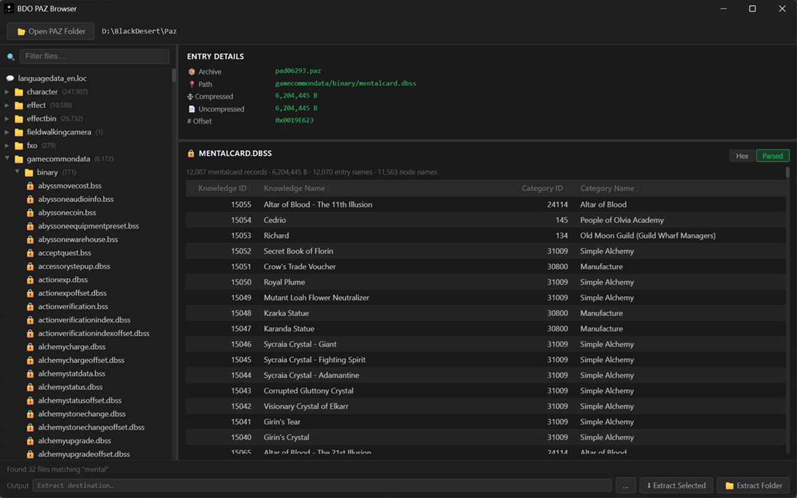

# BDO PAZ Browser & Binary Format Tools

> **Work in progress.** Format coverage is incomplete and the API may change. Contributions and corrections are welcome.

A Python tool for browsing, extracting, and previewing files from **Black Desert Online**'s `.paz` game archives, with a plugin system for parsing BDO-specific binary formats.



---

## Features

- **GUI browser**, tree-view file explorer for the full PAZ archive, with live search and file preview
- **CLI extraction**, extract files by name or glob pattern without opening the GUI
- **File preview**, text, hex dump, DDS images, and parsed binary tables for known formats
- **Paged preview**, large files (hex and parsed tabs) are paged; navigate with Prev/Next without loading the full DOM
- **Tab search**, Ctrl+F inline search within hex (byte offset) and parsed (record) tabs; string and hex-pattern modes
- **Export**, save the current file as raw binary (hex tab) or CSV (parsed tab) via the Entry Details panel
- **Plugin system**, add handlers for new binary formats by dropping a file into `handlers/`
- **Caching**, PAZ index is parsed once and cached; subsequent launches load instantly

---

## Contributing Format Coverage

BDO has hundreds of undocumented binary formats, contributions and corrections are welcome.

**Reverse engineer a new format**, open a new issue using the [file format template](../../issues/new?template=file-format.yml) and title it `filename.ext` (e.g. `yachtdicepreset.dbss` or `.pac`).

**Improve existing docs**, the format docs in [`docs/file-formats/`](docs/file-formats/) are not all complete. Each doc has an **Open Questions** section listing specific unknowns, if you can answer any of them, feel free to update the doc directly.

**Translate the UI**, UI strings live in [`PAZ-Parser/ui/lang/`](PAZ-Parser/ui/lang/) as small JSON files, one per language. Missing keys fall back to English automatically, so partial translations are fine. See [`TRANSLATING.md`](PAZ-Parser/ui/lang/TRANSLATING.md) for instructions.

See [`CONTRIBUTING.md`](CONTRIBUTING.md) for setup, the checks to run before a pull request, and project conventions.

---

## Writing a Preview Handler

Drop a `.py` file (not starting with `_`) into `handlers/`, it is auto-loaded at startup.

All parsed-view handlers must implement two methods:

```python
# handlers/myformat_handler.py
from bdo_preview import PreviewHandler, register_handler
from bdo_models import PazEntry

class MyFormatHandler(PreviewHandler):
    def get_records(self, data: bytes, entry: PazEntry, companions: dict[str, bytes]) -> list[dict]:
        # Parse all records once. Returns plain dicts, no HTML.
        # Cached in memory for paging, tab search, and CSV export.
        return [{"id": r.id, "name": r.name} for r in parse(data)]

    def render_records_page(self, records: list[dict], page: int, page_size: int) -> str:
        # Render one page of records as an HTML fragment.
        start = page * page_size
        slice_ = records[start : start + page_size]
        rows = "".join(f"<tr><td>{r['id']}</td><td>{r['name']}</td></tr>" for r in slice_)
        return f"<table><thead>...</thead><tbody>{rows}</tbody></table>"

register_handler("myfile.dbss", MyFormatHandler())
```

The browser automatically handles:

- Prev/Next page navigation
- Inline tab search (Ctrl+F) across all record field values
- CSV export of the full record list

See [docs/handler.md](docs/handler.md) for the full guide, including companion files, shared helpers, registration patterns, and [adding translations](docs/handler.md#localization).

> **Tip:** Press **Ctrl+R** in the GUI to reload all handlers without restarting the app. If you have a file open on the Parsed tab, the preview re-renders automatically with the updated handler.

---

## Supported Formats

- Handler Supported 25/403 .bss formats.
- Handler Supported 71/374 .dbss formats.
- Handler Supported 24 other formats.

## Documented Formats

See [docs/documented-formats.md](docs/documented-formats.md) for the full table.

---

## Requirements

- Python 3.10+
- [pywebview](https://pywebview.flowrl.com/), GUI shell
- [Pillow](https://python-pillow.org/), optional, for DDS image preview

```
pip install pywebview
pip install pillow        # optional
```

Or install from the provided requirements file:

```
pip install -r PAZ-Parser/requirements.txt
```

---

## Testing

Handler unit tests use pytest and live beside the handler they cover. Missing test inputs are fetched into the gitignored `PAZ-Parser/tests/fixtures/` cache from the configured PAZ folder. When the installed client changes, the next run fetches all of them again (details in `docs/handler.md`).

Install dev dependencies:

```bash
python -m pip install -r PAZ-Parser/requirements-dev.txt
```

Run all unit tests with the full output (a rows / parse time / LOC summary per handler):

```bash
python -m pytest -v -s
```

Or print only failed tests and a pass/total line:

```bash
python -m pytest --clean
```

Open a PAZ folder once in the GUI if fixture fetching has no saved game path yet.

Type-check `PAZ-Parser/` and `browser.py` (from the repo root, so `pyrightconfig.json` applies):

```bash
python -m pyright
```

Run both the tests and pyright before committing a Python change; both should pass with no errors.

---

## Usage

### GUI

```bash
python browser.py
```

On first launch, click **Open Folder** and select your BDO PAZ directory (typically `Black Desert/Paz`). The index is parsed and cached, subsequent launches load from cache automatically.

### CLI

```bash
# List files matching a pattern
python browser.py --paz-folder "C:/Games/Black Desert/Paz" --list "title*.dbss"

# Extract files matching a pattern
python browser.py --paz-folder "C:/Games/Black Desert/Paz" --file "title.dbss" --output ./out

# Glob extraction
python browser.py --paz-folder "C:/Games/Black Desert/Paz" --file "*title*" --output ./out

# Parsed records, as the GUI table has them (LOC and lookup indexes loaded)
python browser.py --records buffsimply.bss --where buff_id=48723..48728
python browser.py --records skill.dbss --where buff_ids=48723 --fields skill_no,name,buff_ids --json
python browser.py --records languagedata_en.loc --where "text*=Adventure's Boon" --limit 5

# One parsed page as a standalone HTML file with the app's CSS and icons
python browser.py --render buffsimply.bss --page 2 > page.html

# Lookup indexes: every kind with its size, all entries of one kind, or one ID
python browser.py --index
python browser.py --index knowledge_characters --limit 20
python browser.py --index buff_icon --id 48724
```

If `--paz-folder` is omitted, the CLI reuses the last folder opened in the GUI.
LOC follows the language picked in the GUI settings. Output is UTF-8 whatever
the console code page, and progress messages go to stderr, so redirected
output holds only the result.

`--records <file>` runs the file's handler `get_records()` with its companions,
the rows behind the GUI table and its CSV export. The file is a PAZ path, a
file name, or a pattern that matches one file. Options:

| Option | Meaning |
|---|---|
| `--where field=value` | Equal. Numbers compare as numbers (`0x` hex allowed), text ignores case, `true` / `false` / `yes` / `no` match flags, `none` (or nothing after `=`) matches an empty cell: no value, blank text or an empty list. A list field matches when any item does |
| `--where field=a..b` | Number in the inclusive range; `a..` and `..b` leave one side open |
| `--where field*=text` | Text contains `text`, ignoring case. Text fields are searched as stored, so `*=\n` finds the two-character newline escape |
| `--fields a,b,c` | Only these fields, in this order |
| `--sort field[:desc]` | Sort as the GUI table does (empty values last, text ignoring case, ties in file order), before `--limit` |
| `--json` / `--csv` | Full values as JSON, or CSV like the app's export. The default is an aligned text table; long cells are cut in the middle so both ends stay (a path keeps its file name), and a single row is shown whole |
| `--limit N` | At most N rows, after filtering |
| `--no-loc` | Skip loading LOC (faster; text columns fall back to inline text) |

Several `--where` options must all match. `--index` takes `--json`, `--csv`
and `--limit` too.

---

## Project Structure

```
PAZ-Parser/
├── bdo_app.py              # Entry point, GUI launch + CLI argument parsing
├── bdo_models.py           # Data models (shared by all handlers)
├── bdo_preview.py          # Preview handler registry + built-in handlers
├── bdo_server.py           # Local HTTP server for stream preview
├── conftest.py             # pytest setup and handler test summary output
├── record_export.py        # Records as CSV (GUI export and --records --csv)
│
├── cli/                    # Command-line commands, one module each
│   ├── session.py          # Loads the PAZ folder headless through Api
│   ├── parsed_file.py      # Resolves a file name to handler, payload, companions
│   ├── files.py            # --list, --file
│   ├── formats.py          # --formats
│   ├── records.py          # --records (record_filter.py, record_output.py)
│   ├── render.py           # --render
│   └── index.py            # --index
│
├── api/                    # pywebview JS API bridge
│   ├── bdo_api.py          # Routing and dispatch
│   ├── bdo_api_helpers.py  # Shared constants and utilities (_norm, _file_icon)
│   ├── bdo_api_preview.py  # Preview assembly and entry loading (PreviewMixin)
│   └── bdo_api_search.py   # File content search, single-file and cross-file (SearchMixin)
│
├── paz/                    # PAZ archive reading and caching
│   ├── bdo_cache.py        # PAZ index cache
│   ├── bdo_ice.py          # ICE cipher implementation
│   ├── bdo_meta_reader.py  # Meta file reader
│   ├── bdo_payload_cache.py# LRU payload cache
│   ├── bdo_payload_reader.py# Payload decompression + ICE decryption
│   ├── bdo_paz_extract.py  # File extraction logic
│   └── bdo_paz_reader.py   # PAZ archive parser
│
├── tests/                  # Unit test framework and gitignored fixtures
│   ├── framework.py        # Public re-export for test helpers
│   ├── specs.py            # DeclaredCountTest, TargetTest, SchemaTest, RangeTest
│   ├── declared.py         # Row counts read from the input for DeclaredCountTest
│   ├── case_input.py       # CaseInput: the bytes a case parsed
│   ├── models.py           # HandlerCase, HandlerResult
│   ├── runner.py           # run_case()
│   ├── fixtures.py         # Auto-fetches test inputs from PAZ folder
│   ├── fixture_sync.py     # Refreshes fixtures when the client changes
│   └── fixtures/           # Gitignored cached binaries
│
├── ui/                     # Web UI (HTML + JS + CSS)
│   ├── index.html
│   ├── app.js              # Entry point, assembles feature modules
│   ├── style.css           # CSS entry point, imports css/ modules
│   ├── css/                # Per-component stylesheets (numbered load order)
│   └── js/
│       ├── core/           # Shared state and helpers
│       └── features/       # Feature modules (tree, search, extraction, …)
│
└── handlers/               # Format preview plugins (auto-loaded)
    ├── dbss_handler.py     # DBSS entry point
    ├── _dbss/              # DBSS format implementations
    │   ├── common/         # Shared binary/HTML helpers
    │   ├── title/
    │   ├── titleoffset/
    │   ├── titlebuff/
    │   ├── mentalcard/
    │   ├── mentaltheme/
    │   ├── knowledgelearning/
    │   ├── npcgift/
    │   ├── quest/
    │   └── questgroup/
    └── _common/            # Helpers shared across formats
        └── loc.py

docs/
├── handler.md              # Guide for writing preview handlers
├── style-guide.md          # UI color palette and component reference
└── file-formats/           # Per-format binary layout documentation
```

---

## Disclaimer

This project is for research purposes only. BDO game data is copyright Pearl Abyss. Do not redistribute extracted game assets.
